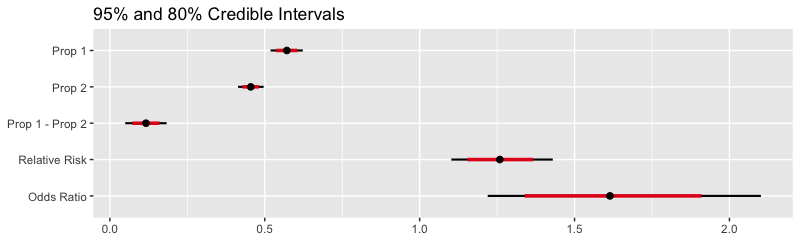
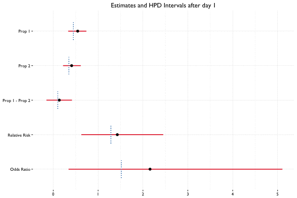

# Bayesian Categorical Data Analysis

This is a set of tools for Bayesian analysis of categorical data, specifically 2×2 contingency tables.

Use:

- `beta_binom()` for analysis using the Beta-Binomial model
  - `print()`, `tidy()`, `glance()`, and `plot()` to view the results
  - `present_bbfit()` if you want a nicely formatted table of summaries to include in a presentation or report
  - `update()` if you have additional data
- `est_multinom()` for estimating multinomial cell probabilities

For more information, see the Tutorial vignette.

## Installing

```R
install.packages("devtools")
devtools::install_github("bearloga/BCDA")
```

## Usage

All examples will use the following (fake) data:

```R
data <- matrix(c(200, 150, 250, 300), nrow = 2, byrow = TRUE)
colnames(data) <- c('Safe' ,'Dangerous')
rownames(data) <- c('Animals', 'Plants')
(data)
```

|        | Safe| Dangerous|
|:-------|----:|---------:|
|Animals |  200|       150|
|Plants  |  250|       300|

**Note** that `beta_binom()` uses the Jeffreys prior by default.

```R
library(BCDA) # options(digits = 2)

set.seed(0)
(fit <- beta_binom(data))
```

```
           term estimate std.error conf.low conf.high
1            p1     0.57     0.027     0.52      0.62
2            p2     0.45     0.021     0.41      0.50
3     prop_diff     0.12     0.034     0.05      0.18
4 relative_risk     1.26     0.083     1.10      1.43
5    odds_ratio     1.61     0.225     1.22      2.10
```

The credible intervals above are calculated using quantiles. If we have the **coda** package installed, we can also obtain the high posterior density intervals:

```R
print(fit, interval_type = "HPD")
```

```
           term estimate std.error conf.low conf.high
1            p1     0.57     0.027    0.519      0.62
2            p2     0.45     0.021    0.413      0.50
3     prop_diff     0.12     0.034    0.051      0.18
4 relative_risk     1.26     0.083    1.096      1.42
5    odds_ratio     1.61     0.225    1.198      2.07
```

```R
plot(fit)
```



## Presentation of the results

The package includes a variety of functions for looking at the results from fitting a `beta_binom()` model. To aid in functional programming, we implemented the `tidy()` and `glance()` verbs from David Robinson's **broom** package for users:

```R
library(magrittr)
fit %>% tidy %>% head(2)
```

```
  term estimate std.error conf.low conf.high
1   p1     0.57     0.027     0.52      0.62
2   p2     0.45     0.021     0.41      0.50
```

```R
fit %>% glance
```

```
   n1  n2                      p1                      p2
1 350 550 57.12% (51.88%, 62.29%) 45.48% (41.38%, 49.63%)
```

This is perfectly okay in an interative data analysis scenario, but not when presenting the results in a report. `glance()` is actually a special case of the `present_bbfit()` function which generates all those nicely formatted credible intervals but outputs a Markdown/LaTeX-formatted table by default:

```R
present_bbfit(fit)
```

| Group 1| Group 2|Pr(Success) in Group 1  |Pr(Success) in Group 2  |Difference             |Relative Risk     |Odds Ratio        |
|-------:|-------:|:-----------------------|:-----------------------|:----------------------|:-----------------|:-----------------|
|     350|     550|57.12% (51.88%, 62.29%) |45.48% (41.38%, 49.63%) |11.64% (4.96%, 18.30%) |1.26 (1.10, 1.43) |1.61 (1.22, 2.10) |

The point estimates include credible intervals by default but these can be turned off:

```R
present_bbfit(fit, conf_interval = FALSE, digits = 3)
```

| Group 1| Group 2|Pr(Success) in Group 1 |Pr(Success) in Group 2 |Difference |Relative Risk |Odds Ratio |
|-------:|-------:|:----------------------|:----------------------|:----------|:-------------|:----------|
|     350|     550|57.122%                |45.479%                |11.643%    |1.259         |1.614      |

Since the underlying code uses `tidy()` to compute the summaries, we can specify a particular credible level and the type of interval we want (e.g. highest posterior density):

```R
present_bbfit(fit, conf_level = 0.8, interval_type = "HPD")
```

| Group 1| Group 2|Pr(Success) in Group 1  |Pr(Success) in Group 2  |Difference             |Relative Risk     |Odds Ratio        |
|-------:|-------:|:-----------------------|:-----------------------|:----------------------|:-----------------|:-----------------|
|     350|     550|57.12% (53.68%, 60.50%) |45.48% (42.74%, 48.10%) |11.64% (7.22%, 15.92%) |1.26 (1.15, 1.36) |1.61 (1.30, 1.87) |

It also supports multiple models, which can be provided as a named or an unnamed list. See the example below.

## Updating the posterior

In Bayesian statistics, we can reuse a previously computed posterior as a prior if we have additional data, allowing us to update the parameter estimates as new data becomes available. Suppose we collect 40 observations from 2 groups (20 per group) on the first day of the A/B test, and 10 observations per day for the next 2 weeks. Here we see what happens when we update the posterior with additional data on a daily basis:



### Example Code

```R
fit_2 <- update(fit, x = c(100, 200), n = c(400, 600))
present_bbfit(list("Day 1" = fit, "Day 2" = fit_2))
```

|      | Group 1| Group 2|Pr(Success) in Group 1  |Pr(Success) in Group 2  |Difference             |Relative Risk     |Odds Ratio        |
|:-----|-------:|-------:|:-----------------------|:-----------------------|:----------------------|:-----------------|:-----------------|
|Day 1 |     350|     550|57.12% (51.88%, 62.29%) |45.48% (41.38%, 49.63%) |11.64% (4.96%, 18.30%) |1.26 (1.10, 1.43) |1.61 (1.22, 2.10) |
|Day 2 |     750|    1150|39.96% (36.45%, 43.24%) |39.18% (36.23%, 42.01%) |0.78% (-3.73%, 5.08%)  |1.02 (0.91, 1.13) |1.04 (0.85, 1.24) |

If you *purrrfer*, you can achieve similar results the following way:

```R
list("1" = fit, "2" = fit_2) %>%
  purrr::map_df(present_bbfit, raw = TRUE, .id = "Day") %>%
  # ...other manipulations... %>%
  knitr::kable()
```

|Day | Group 1| Group 2|Pr(Success) in Group 1  |Pr(Success) in Group 2  |Difference             |Relative Risk     |Odds Ratio        |
|:---|-------:|-------:|:-----------------------|:-----------------------|:----------------------|:-----------------|:-----------------|
|1   |     350|     550|57.12% (51.88%, 62.29%) |45.48% (41.38%, 49.63%) |11.64% (4.96%, 18.30%) |1.26 (1.10, 1.43) |1.61 (1.22, 2.10) |
|2   |     750|    1150|39.96% (36.45%, 43.24%) |39.18% (36.23%, 42.01%) |0.78% (-3.73%, 5.08%)  |1.02 (0.91, 1.13) |1.04 (0.85, 1.24) |

## See also

Other packages for Bayesian analysis of A/B tests include: [LearnBayes](https://cran.r-project.org/web/packages/LearnBayes/index.html) (GPL), [conting](https://cran.r-project.org/web/packages/conting/index.html) (GPL), [bandit](https://cran.r-project.org/web/packages/bandit/index.html) (GPL), [testr](https://github.com/ayakubovich/testr) (MIT).

---------

Please note that this project is released with a [Contributor Code of Conduct](CONDUCT.md). By participating in this project you agree to abide by its terms.
