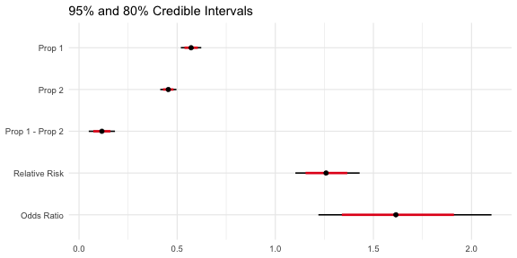

Bayesian Categorical Data Analysis
================

<!-- README.md is generated from README.Rmd. Please edit that file -->

# BCDA

This is a set of tools for Bayesian analysis of categorical data,
specifically 2×2 contingency tables.

Use:

-   `beta_binom()` for analysis using the Beta-Binomial model
    -   `print()`, `tidy()`, `glance()`, and `plot()` to view the
        results
    -   `present_bbfit()` if you want a nicely formatted table of
        summaries to include in a presentation or report
    -   `update()` if you have additional data
-   `est_multinom()` for estimating multinomial cell probabilities

## Installation

You can install the development version from
[GitHub](https://github.com/) with:

``` r
# install.packages("remotes")
remotes::install_github("bearloga/BCDA")
```

## Example

`beta_binom()` works with a table of the following format:

|         | Success | Failure |
|--------:|:-------:|:-------:|
| Group 1 |   n11   |   n12   |
| Group 2 |   n21   |   n22   |

and uses the Beta-Binomial model to estimate:

|         | Success | Failure |
|--------:|:-------:|:-------:|
| Group 1 |   p1    | 1 - p1  |
| Group 2 |   p2    | 1 - p2  |

which allows inference on the difference (`p1 - p2`), the risk ratio
(RR), and the odds ratio (OR), defined as follows:

-   `RR = p1 / p2` – how much more likely success in group 1 is,
    relative to success in group 2
-   `OR = (p1/(1-p1)) / (p2/(1-p2))` – the ratio of the odds – where
    `p1/(1-p1)` is the odds of success in group 1 and `p2/(1-p2)` is the
    odds of success in group 2

All examples will use the following fake data:

``` r
fake_data <- matrix(c(200, 150, 250, 300), nrow = 2, byrow = TRUE)
colnames(fake_data) <- c('Safe' ,'Dangerous')
rownames(fake_data) <- c('Animals', 'Plants')
```

|         | Safe | Dangerous |
|:--------|-----:|----------:|
| Animals |  200 |       150 |
| Plants  |  250 |       300 |

**Note** that `beta_binom()` uses the Jeffreys prior by default and that
this README was knit with the seed set to 0 at the start for
reproducibility.

``` r
library(BCDA)
#> For article references, see ?BCDA

(fit <- beta_binom(fake_data))
#> # A tibble: 5 x 5
#>   term          estimate std.error conf.low conf.high
#>   <chr>            <dbl>     <dbl>    <dbl>     <dbl>
#> 1 p1               0.571    0.0266    0.623    0.519 
#> 2 p2               0.455    0.0211    0.496    0.414 
#> 3 prop_diff        0.116    0.0340    0.183    0.0496
#> 4 relative_risk    1.26     0.0832    1.43     1.10  
#> 5 odds_ratio       1.61     0.225     2.10     1.22
```

The credible intervals above are calculated using quantiles. If we have
the **coda** package installed, we can also obtain the high posterior
density intervals:

``` r
print(fit, interval_type = "HPD")
#> # A tibble: 5 x 5
#>   term          estimate std.error conf.low conf.high
#>   <chr>            <dbl>     <dbl>    <dbl>     <dbl>
#> 1 p1               0.571    0.0266   0.519      0.623
#> 2 p2               0.455    0.0211   0.413      0.496
#> 3 prop_diff        0.116    0.0340   0.0512     0.184
#> 4 relative_risk    1.26     0.0832   1.10       1.42 
#> 5 odds_ratio       1.61     0.225    1.20       2.07
```

``` r
plot(fit)
```

<div class="figure">


<p class="caption">
Preview of visualization of the posterior draws.
</p>

</div>

## Presentation of the results

The package includes a variety of functions for looking at the results
from fitting a `beta_binom()` model. To aid in functional programming,
we implemented the `tidy()` and `glance()` verbs:

``` r
library(magrittr) # for %>%
#> Warning: package 'magrittr' was built under R version 4.0.2
fit %>%
  tidy %>%
  knitr::kable()
```

| term           | estimate | std.error | conf.low | conf.high |
|:---------------|---------:|----------:|---------:|----------:|
| p1             |     0.57 |      0.03 |     0.62 |      0.52 |
| p2             |     0.45 |      0.02 |     0.50 |      0.41 |
| prop\_diff     |     0.12 |      0.03 |     0.18 |      0.05 |
| relative\_risk |     1.26 |      0.08 |     1.43 |      1.10 |
| odds\_ratio    |     1.61 |      0.23 |     2.10 |      1.22 |

When knitting R Markdown to HTML, you can use the
[{gt}](https://gt.rstudio.com/) package for creating tables:

``` r
library(gt)
fit %>%
  tidy %>%
  gt(rowname_col = "term") %>%
  tab_header(md("Results of `beta_binom()`"))
```

`glance()` is used to

> Construct a single row summary “glance” of a model, fit, or other
> object

``` r
fit %>%
  glance
#> # A tibble: 1 x 8
#>   `Beta-Binom Fit` `Group 1` `Group 2` `Pr(Success) in… `Pr(Success) in…
#>   <chr>                <int>     <int> <chr>            <chr>           
#> 1 1                      350       550 57.12% (62.29%,… 45.48% (49.63%,…
#> # … with 3 more variables: Difference <chr>, `Relative Risk` <chr>, `Odds
#> #   Ratio` <chr>
```

This is perfectly okay in an interactive data analysis scenario, but not
when presenting the results in a report. `glance()` is actually a
special case of the `present_bbfit()` function which generates all those
nicely formatted credible intervals but outputs a
Markdown/LaTeX-formatted table by default:

``` r
present_bbfit(fit)
```

| Beta-Binom Fit | Group 1 | Group 2 | Pr(Success) in Group 1  | Pr(Success) in Group 2  | Difference             | Relative Risk        | Odds Ratio           |
|:---------------|--------:|--------:|:------------------------|:------------------------|:-----------------------|:---------------------|:---------------------|
| 1              |     350 |     550 | 57.12% (62.29%, 51.88%) | 45.48% (49.63%, 41.38%) | 11.64% (18.30%, 4.96%) | 125.87 (18.30, 4.96) | 161.44 (18.30, 4.96) |

The point estimates include credible intervals by default but these can
be turned off:

``` r
present_bbfit(fit, conf_interval = FALSE, digits = 3)
```

| Beta-Binom Fit | Group 1 | Group 2 | Pr(Success) in Group 1 | Pr(Success) in Group 2 | Difference | Relative Risk | Odds Ratio |
|:---------------|--------:|--------:|:-----------------------|:-----------------------|:-----------|:--------------|:-----------|
| 1              |     350 |     550 | 57.122%                | 45.479%                | 11.643%    | 125.874       | 161.438    |

Since the underlying code uses `tidy()` to compute the summaries, we can
specify a particular credible level and the type of interval we want
(e.g. highest posterior density):

``` r
present_bbfit(fit, conf_level = 0.89, interval_type = "HPD")
```

| Beta-Binom Fit | Group 1 | Group 2 | Pr(Success) in Group 1  | Pr(Success) in Group 2  | Difference             | Relative Risk        | Odds Ratio           |
|:---------------|--------:|--------:|:------------------------|:------------------------|:-----------------------|:---------------------|:---------------------|
| 1              |     350 |     550 | 57.12% (52.98%, 61.50%) | 45.48% (42.18%, 48.91%) | 11.64% (6.29%, 17.08%) | 125.87 (6.29, 17.08) | 161.44 (6.29, 17.08) |

It also supports multiple models, which can be provided as a named or an
unnamed list. See the example below.

## Updating the posterior

In Bayesian statistics, we can reuse a previously computed posterior as
a prior if we have additional data, allowing us to update the parameter
estimates as new data becomes available. Suppose we collect 40
observations from 2 groups (20 per group) on the first day of the A/B
test, and 10 observations per day for the next 2 weeks. Here we see what
happens when we update the posterior with additional data on a daily
basis:


### Example Code

``` r
fit_2 <- update(fit, x = c(100, 200), n = c(400, 600))
present_bbfit(list("Day 1" = fit, "Day 2" = fit_2))
```

| Beta-Binom Fit | Group 1 | Group 2 | Pr(Success) in Group 1  | Pr(Success) in Group 2  | Difference             | Relative Risk        | Odds Ratio           |
|:---------------|--------:|--------:|:------------------------|:------------------------|:-----------------------|:---------------------|:---------------------|
| Day 1          |     350 |     550 | 57.12% (62.29%, 51.88%) | 45.48% (49.63%, 41.38%) | 11.64% (18.30%, 4.96%) | 125.87 (18.30, 4.96) | 161.44 (18.30, 4.96) |
| Day 2          |     750 |    1150 | 39.96% (43.24%, 36.45%) | 39.17% (42.01%, 36.23%) | 0.78% (5.08%, -3.73%)  | 102.14 (5.08, -3.73) | 103.80 (5.08, -3.73) |

## See also

Other packages for Bayesian analysis of A/B tests include:
[LearnBayes](https://cran.r-project.org/web/packages/LearnBayes/index.html)
(GPL),
[conting](https://cran.r-project.org/web/packages/conting/index.html)
(GPL),
[bandit](https://cran.r-project.org/web/packages/bandit/index.html)
(GPL), [testr](https://github.com/ayakubovich/testr) (MIT).

------------------------------------------------------------------------

Please note that this project is released with a [Contributor Code of
Conduct](CONDUCT.md). By participating in this project you agree to
abide by its terms.
